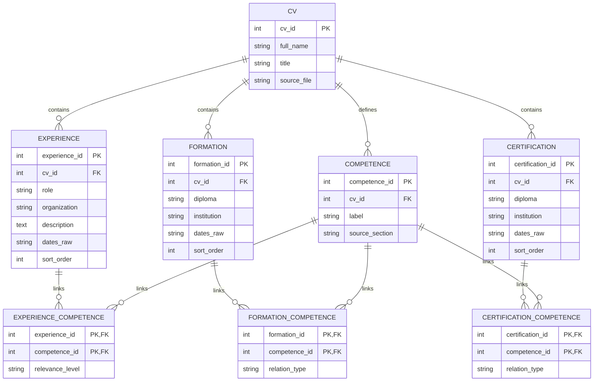

# CV Database Schema (from `cv.yaml`)

Mapping used from YAML:
- `main.experiences.entries` -> `EXPERIENCE`
- `sidebar.formations.entries` -> `FORMATION`
- `sidebar.certifications.entries` -> `CERTIFICATION`
- `sidebar.skills.items` (+ optional normalized skills from `main.digital.categories`) -> `COMPETENCE`

